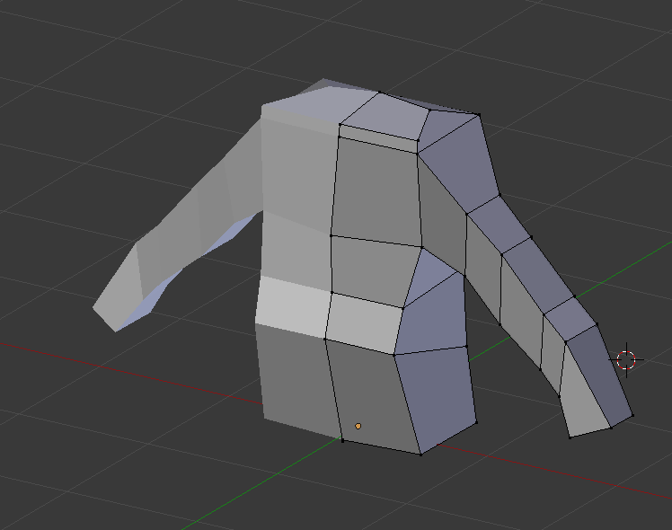
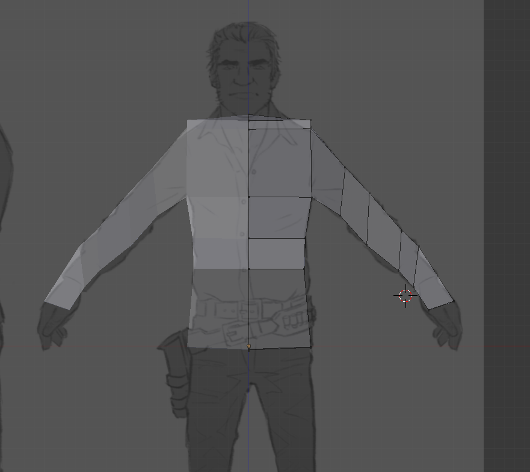

<h1>Week 3: Blender: It's fun</h1>

<h3>Re-cap!</h3>
Since the last week, I was messing about with Unity, in particular learning about the UI and the components like the RigidBody (which gives objects physics). I hit a block in the form of SCRIPTS, a component that involves C# to give objects the basics like movement. I then left Unity again (sorry!) and went back to my child, Blender. Since the last week, I have explored some of the different modes of Blender: Edit, Sculpt, Object mode <insert img here>. And so, I followed my plan SLIGHTLY before deviating towards editing and creating a low poly model.
 

<h3>Blender: Designing a model and learning about Rigs!</h3>
<h4>Quick Description</h4>
So, I have a model, now what? If you want to keep it as a still rendering, you're done! If you want to animate it, however, it's far from over. There has to be a rig for the model. In simpler terms, a rig is equivalent to the skeleton and all the muscles a human has, it allows us to move and what not.
 
<h3>Introducing Armatures!</h3>

These are the joints that make up the entire rig.
https://docs.blender.org/manual/en/latest/rigging/armatures/introduction.html#your-first-armature
I haven't experimented too much with armatures and rigs (I've yet to create my own model to rig... so..) but I did read up on them and glimpsed a bit about how it would work in Unity. Let me just say, my partner's going to have one heck of a time figuring it out in Unity and scripting it. Moving on then.

<h4>Back to the stuff I'm actually tinkering and smashing around!</h4>
The tutorials I've watched about creating a low poly model, almost all of them use a background image that has a front view and a side view of something. The model is "built" in the basic shape of the drawing itself and having both allows you to adjust the size and basic shapes to match that of the drawing. They also delete half of the initial block that they work with so they can apply the "Mirror" modifier so they can work on one side without worry. Personally, I think the reason why they do that is so that it's symmetrical and makes the modelling process easier for themselves.  
I've made some some progress but geez, it's so darn ugly.  

 
I was thinking the whole time while making it, "There has got to be an easier way to create this and not... make it look so doo-doo" and I forgot to note down what I wanted to do to solve this problem.

