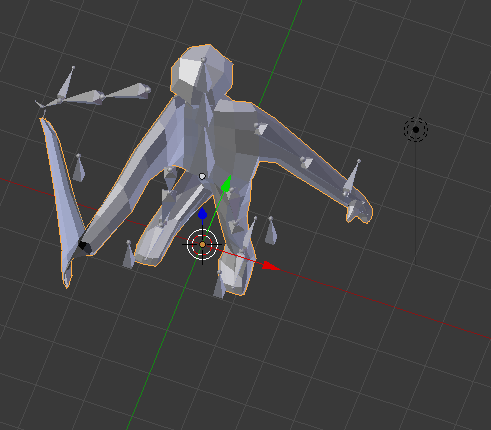

<h1> Week 4: Modelling and Rigging</h1>
 
<h3>First off, Recap!</h3>
So what'd I do since last week. A lot of testing here and there in blender, watching tutorials on creating models and then beginning to rig them for animation purposes. Last week was all about learning about how to create a model, specifically a low-polygon model and just scratching the surface about armatures. Oh, there was also the check-list that I created for myself on week 3

<h3> Rigs! </h3>
<h4>Quick description: What are they?</h4>
For most people that use Blender, many people create brilliant and stunning models that are static (still renderings, they don't move). If they wanted their creations to be allowed to move akin to that of a human or an animal, they'd give them what humans and animals all have in common, a skeleton or in Blender terms, a rig.

<h6> Sorry if the labelling is hard to read but you don't have to worry about that too much since it's mainly for me to figure out which bone is which</h6>
 
And so, without further ado!

<h3>Armatures and Rigging</h3>
During school-week leading up to Spring Break in addition to the week from the break, I made a very simplistic round model for the sole purpose of rigging it and readying it for animations.

And here's the model + rig! This was give or take a few hours of me scrambling about, constantly re-watching tutorials because I didn't understand, tinkering and whatnot to create with some big problems along the way, to create with some minor issues which I'll talk about later. But first, here are some images of what I struggled with:

 
So with the amount of time I had, I managed to churn out only this model that has a functional rig (somewhat) and another model that is somewhat messed up without a rig. When I say somewhat for the functional rigged model, I meant that while it works, it doesn't work similar to how a human body's body would move. Take the leg for example, a normal human like me or you reading this can extend it forward and bend the knee at a 90 degree angle, keywoard "foward". My model, however, is messed up and doesn't seem to understand what "foward" is and just bends however it likes, more often than not at like a 45 degree angle and begins to drag the whole hip with the joints horizontally. 
<h3>Problems galore</h3>
As such, here comes the problems I encountered. One of which was the deformalities that my whole model had (the two pictures with the model's right side broken) despite connecting the rig and the mesh (model) into one. As it turned out, after a good hour of undo-ing progress and backtracking, I had found out that I used the "Mirror" modifier so I could create a symmetrical model and forgot to actually apply it, resulting in the deformed right side for the body after combining both. I had apparently remembered it when I was sharing my issue with my group where at one point, they pointed out that ONLY the right side was being messed up, triggering the memory of the Mirror modifier.
 
Another was the issue of figuring out something called Inverse Kinematics (IK) which didn't really make much sense to me. The tutorials I watched all utilized them but I ignored them and wound up with a model that required me to move EVERY, SINGLE, BONE, INDIVIDUALLY, just to prep and test if the rig actually works for animating purposes. It was such a mind-numbing process to do it and so when I read up more about IK and actually implemented it (the floating armatures in front of the knee and elbow and also the two armatures extending outwards at the wrists and ankles), my goodness did it save a lot of time testing out the joints. So IK essentially binds another armature to the IK and connects to it, allowing for the whole segment of joints to be controlled by the one IK. Need to move the arm? No problem, let me just grab the wrist IK and move it forward, bam, whole arm's moved for you. Despite the blessings of IKs, I still had issues with it such as the messed up knee bending part.

<h3>Next Week Plans!</h3>
Aside from the problems I faced, there are still a lot of things that I need to create for Unity when my partners and I finally come together to combine all our learnings.
<ul>
  <li>Finalize the model and the rig</li>
  <li>Begin to work on modelling terrain, tutorials, etc.</li>
  <li>Begin texturing stuff, i.e. adding some textures to the models I currently have.</li>
</ul>

<h2> TAKEAWAYS! </h2>
<ul>
  <li><strong>Work through your problems slowly.</strong> If you get hit with a sudden bug or problem, be patient with it. It's fine to be frustrated with the issue, I know I was with my deformed models, but think through it. What did I just do? What went wrong just now? What is it supposed to do? If you have to, take a break, stroll around for a bit and think about it because it certainly worked for me, albeit I took an hour as a part of "my break".</li>
  <li><strong>Vocalize your problems to others.</strong>More often than not, talking to others about the problems you have will help you realize an issue or someone will point out something for you. That was the case for me when I had complained about my model issue to my group mates and they pointed out a possible cause for my problem which turned out to be the solution to my issue.</li>
</ul>
