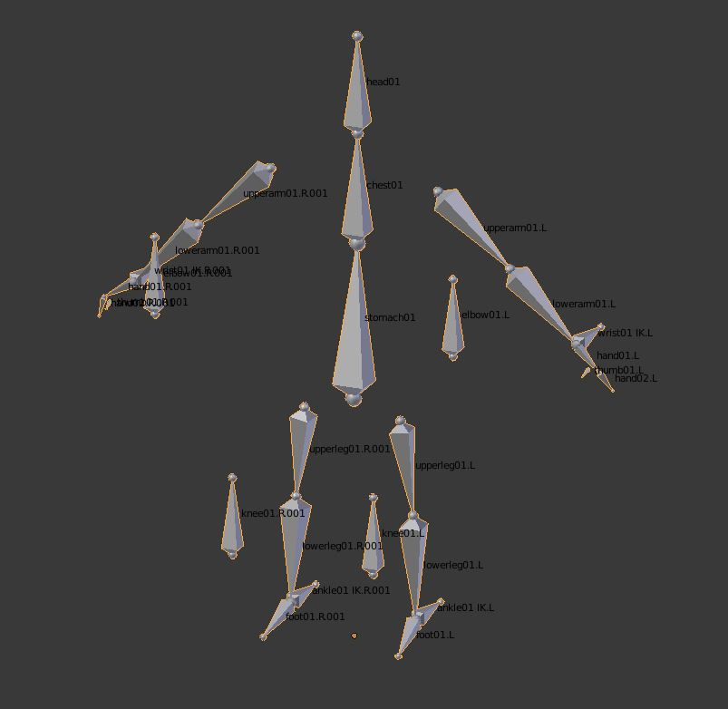
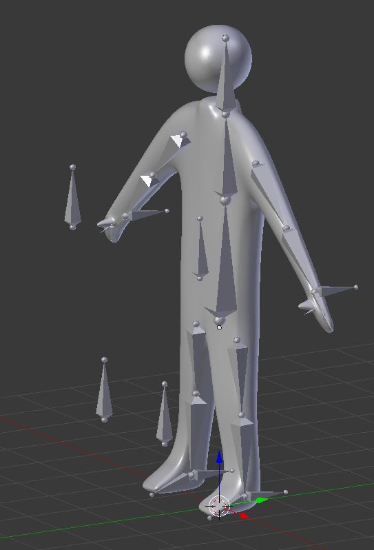
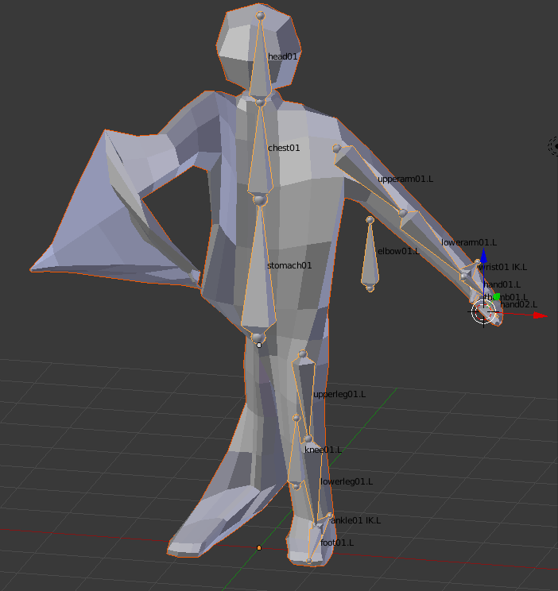

<h1> Week 4: Modelling and Rigging</h1>
 
<h3>First off, Recap!</h3>
So what'd I do since last week. A lot of testing here and there in blender, watching tutorials on creating models and then beginning to rig them for animation purposes. Last week was all about learning about how to create a model, specifically a low-polygon model and just scratching the surface about armatures. Oh, there was also the check-list that I created for myself on week 3

<h3> Rigs! </h3>
<h4>Quick description: What are they?</h4>
For most people that use Blender, many people create brilliant and stunning models that are static (still renderings, they don't move). If they wanted their creations to be allowed to move akin to that of a human or an animal, they'd give them what humans and animals all have in common, a skeleton or in Blender terms, a rig.

<h6> Sorry if the labelling is hard to read but you don't have to worry about that too much since it's mainly for me to figure out which bone is which</h6>
 
And so, without further ado!

<h3>Armatures and Rigging</h3>
During school-week leading up to Spring Break in addition to the week from the break, I made a very simplistic round model for the sole purpose of rigging it and readying it for animations.

And here's the model + rig! This was give or take a few hours of me scrambling about, constantly re-watching tutorials because I didn't understand, tinkering and whatnot to create with some big problems along the way, to create with some minor issues which I'll talk about later. But first, here are some images of what I struggled with:

