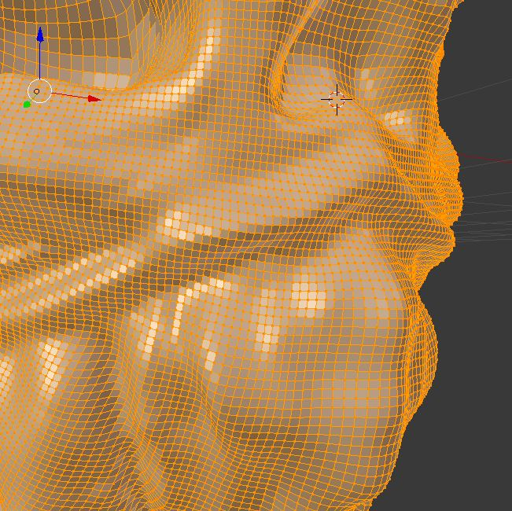

<h1> Week 5: Sculpting </h1>

<h3>Recap from last week </h3>
Since last week, I've been really just creating and tinkering with stuff on Blender, namely setting up rigs for models. That was done but the results of the models didn't exactly appeal to me so I followed the timeline that I had initially set for myself way back when first starting off with still renderings into low-poly models and then lastly sculpting models. I sort of sped through still renderings and jumped straight into low-poly models and rigging them solely for the purpose of providing something for my partner to work within Unity which was the product of last week, a model that distorts whenever joints are manipulated.

<h4>Sculpting in Blender</h4>
<h5>Quick description!</h5>
What exactly is sculpting in Blender? Well for starters, it's best that you think of it like having a clay block and being able to shape it however you like. In sculpt mode, you would need to have a base model first because think about it, you can't exactly mold anything if you haven't got anything (something I learned the hard way when I first began tinkering around with it). From there on, you can just play around with it like you would with actual clay.
 

 
I tinkered about with sculpting, just creating random lines here and there and just went nuts in creating something random as I was quite curious with what was possible through sculpting. A good 30-ish minutes later, I just created something random that looked like a monster which I liked quite a bit. Then came the problems with sculpting.
 
<h4>Issues with Sculpting</h4>

The difference between molding clay and molding an object is that when you mold an object, you need multiple faces as shown in the above picture to take shape. Want a small and smooth bump somewhere? You'd better have enough faces to create that smoothness. This is where the issue comes in, it creates a lot of faces just to create the desired shape. It causes a lot of lag and slows down everything if I try to make any adjustments to the model itself in edit mode like extending a portion of the model (in the case of this test sculpture, perhaps adding a neck) would strain the system a lot.
 
This ties into my progress in creating low-poly models. You'd generally want to have the basic shape of anything you want to begin sculpting. An example would be having basic rectangles make up the shape of a human body so that you can avoid having to create those sorts of shapes once you've already begun sculpting since again, it lags out the program. The lesson of having learned something that pertains to your goal will eventually come to assist you.

<h3>TAKEAWAYS!</h3>
<ul>
  <li><strong>It's never a waste of time to learn something.</strong>For my situation, I slowly progressed through the basics of creating models and of the sort in Blender and while it felt like it didn't get me to where I wanted to be instantly, it certainly helped when I needed that knowledge. To sculpt, you need a basic foundation to begin molding to avoid any future complications that would usually require a full restart of the process, this is where the several weeks of learning about ONLY low-poly models came into play. It felt like a waste of time but it certainly helped me.</li>
</ul>
