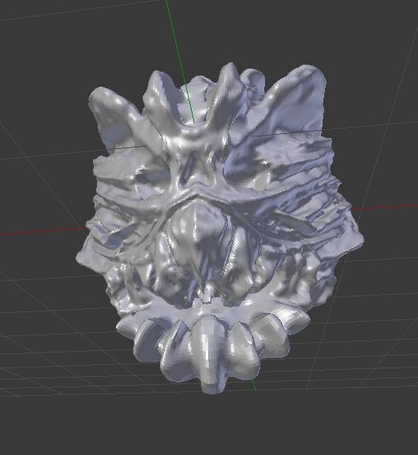

<h1> Week 5: Sculpting </h1>

<h3>Recap from last week </h3>
Since last week, I've been really just creating and tinkering with stuff on Blender, namely setting up rigs for models. That was done but the results of the models didn't exactly appeal to me so I followed the time-line that I had initially set for myself way back when, first starting off with still renderings into low-poly models and then lastly sculpting models. I sort of sped through still renderings and jumped straight into low-poly models and rigging them solely for the purpose of providing something for my partner to work with in Unity which was the product of last week, a model that distorts whenever joints are manipulated.

<h4>Sculpting in Blender</h4>
<h5>Quick description!</h5>
What exactly is sculpting in Blender? Well for starters, it's best that you think of it like having a clay block and being able to shape it however you like. In sculpt mode, you would need to have a base model first because think about it, you can't exactly mold anything if you haven't got anything (something I learned the hard way when I first began tinkering around with it). From there on, you can just play around with it like you would with actual clay.
 

 
I tinkered about with sculpting, just creating random lines here and there and just went nuts in creating something random as I was quite curious with what was possible through sculpting. A good 30-ish minutes later, I just created something random that looked like a monster which I liked quite a bit. Then came the problems about sculpting.

<h4>Issues with Sculpting</h4>

