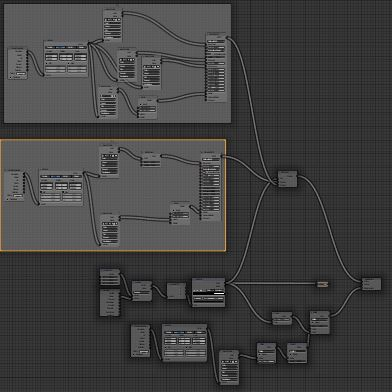
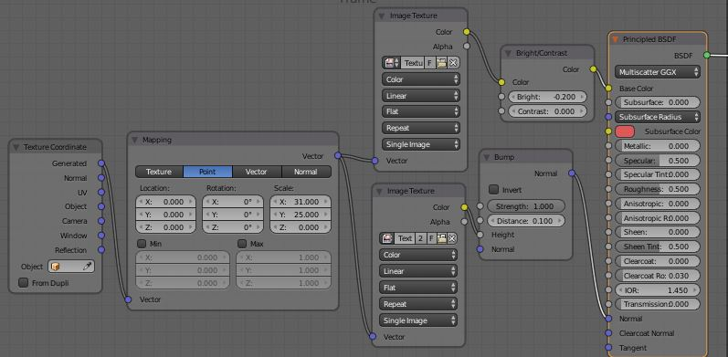
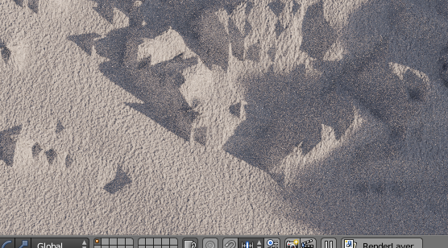
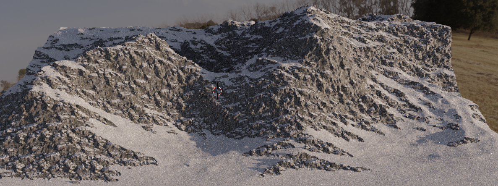
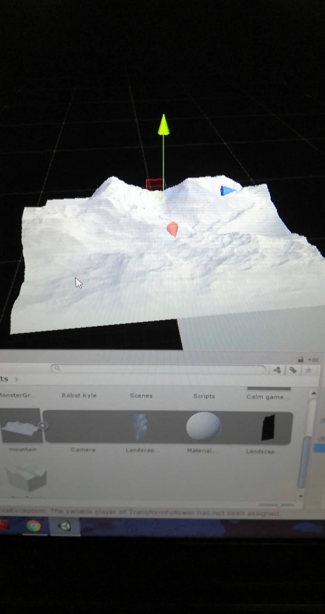
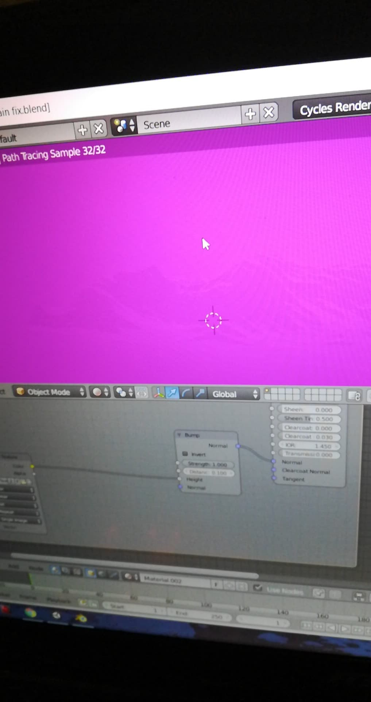

<h1>Week 6: Rendering and Exporting</h1>

<h3>Recap from last week</h3>
Alright then, let's get started. During week 5, I was mainly just messing around, sculpting some random thing that apparently came up to 20+ megabytes (massive, I know). It wasn't all that much, a lot of it was just goofing about, that about sums it up really.

<h3> This week</h3>
What have I been doing this week? I started rendering a mountain and trying to export it, DAMN YOU FILE FORMATS FOR NOT SUPPORTING TEXTURES!!!! *cough* Excuse me. Back on track, with a deadline that my partner set for me and the actual hard deadline for this project to have a minimum viable product (in the form of something presentable for the school Expo where we show off projects that we're most proud of), I went back to rendering and modelling a landscape because that's what my partner, Shi Wei, needed as a part of our random simulation of sorts game thing.

The tutorial: https://www.youtube.com/watch?v=qSafYNQrodk&t=1964s
(thank you CG Geek for the blessed tutorial)
 
<h3> Quick Description </h3>
In case you've forgotten what rendering is or I never explained it and you've gotten to this point, no need to worry because I'll explain it again. Rendering, in my own words, is creating a still object or model that is perfect for a photographing or animations, it looks appealing and is generally just a model without anything fancy compared to giving models a rig.
 
Okay, I lied about the lack of fanciness.
 

<h3>Nodes and Texturing</h3>
The tutorial itself did an excellent job in demonstrating how to create the mountain and providing the textures for it but it never really explained what the nodes are for so for a good bit of time, I was confused as I stared at the video and the web of blocks of Scratch code. However, I took some time to figure out what nodes are or at least tried to.
https://docs.blender.org/manual/en/latest/render/blender_render/materials/nodes/introduction.html
 
I felt like when I got hit with the deadlines, I just crunched a bit and skipped a lot of basics because as I was reading the documentation for nodes, I was like "what is the material menu and what is texture coordinate thing" but I did get a REALLY basic and amateur understanding of what nodes are. Now, it's really important that you just don't binge watch tutorials but rather actually try to learn some of the things shown in the tutorial like nodes in my case. Back to the matter at hand, nodes are pretty much little blocks of instructions that tell Blender what effects or textures are being applied to the model. Just think of them as Scratch code blocks if you know what I'm talking about. To be honest, I just followed the tutorial but didn't understand the majority of the nodes that CG Geek used, only a few like the Image Texture node which allows you to import texture files like png or jpg files to be applied to the model. A lot of the nodes allow for textures like rocks and snow to appear on the model otherwise it'd just be a plain gray model and some of the nodes enable specific textures to appear on specific locations like rocks under the snow that is covering everything (you'll see in a bit).

 
Following the tutorial for not even 40 minutes, I got something like this:
 

 
Which all look really darn nice and it was enough for my partner to say "that's fine, send it over so I can test it".
And cue the problems.

<h3>Problems with Exporting</h3>
Remember when I complained about file formats? Yeah, those are painful. So Shi Wei's been using a file format called .fbx that I've been sending him and up until now, that was all fine and dandy. What I found out about .fbx format is that it doesn't support textures, meaning it doesn't save ANY of the textures that I've applied so all Shi Wei got was a white model with literally nothing on it when he imported the file into Unity:
 

 
Trust me, the problem still isn't fixed and I'm slightly annoyed about it. Okay, maybe not slightly, maybe I was EXTREMELY annoyed about it. And cut in problem number two, I tried sending Shi Wei the blender file to see if that would help with having the textures but I forgot about the problem in doing so. Remember, nodes like the Image Texture node allow you to use texture files to be uploaded and applied but only locally. That means that Shi Wei wouldn't see any of the textures because he doesn't have any of the textures downloaded and since the path to finding those textures doesn't exist on Shi Wei's computer, it just gives him a bright pink block of beautifulness and annoyance:
 

 
Which really isn't that big of a problem because all I need to do is send Shi Wei the textures and have him fix the pathway to find the textures. What the main issue is figuring out how to keep the textures when importing the model over to Unity which sadly as of 5/12/19 around 9:00 PM, I still don't have a solution to.

<h1> TAKEAWAYS </h1>
<ul>
  <li><strong>Don't just watch tutorials, tinker alongside.</strong> Tutorials exist to help you understand something quickly but don't watch tutorials after tutorials and expect to be a master of the subject because that's not how it works. It's best if you watch the tutorial while actually doing it yourself because you may find something that you never learned about but relates to your goals. In my case, CG Geek's tutorial showed nodes and didn't go into too many details about it which were pretty important for textures since I figured out that it's something I should at least understand.</li>
  <li><strong>Tinker your problems away and pray.</strong> I don't stress it enough but tinker, tinker, maybe a little sandbox too. A lot of problems can pop up when you work on assignments or side-projects for yourself. No need to beat yourself up over finding a solution immediately but rather just take your time (if you have any) to just slowly work it out. For me, I just said screw it for the night and I'm planning on trying to fix it during the start of week 7</li>
</ul>
