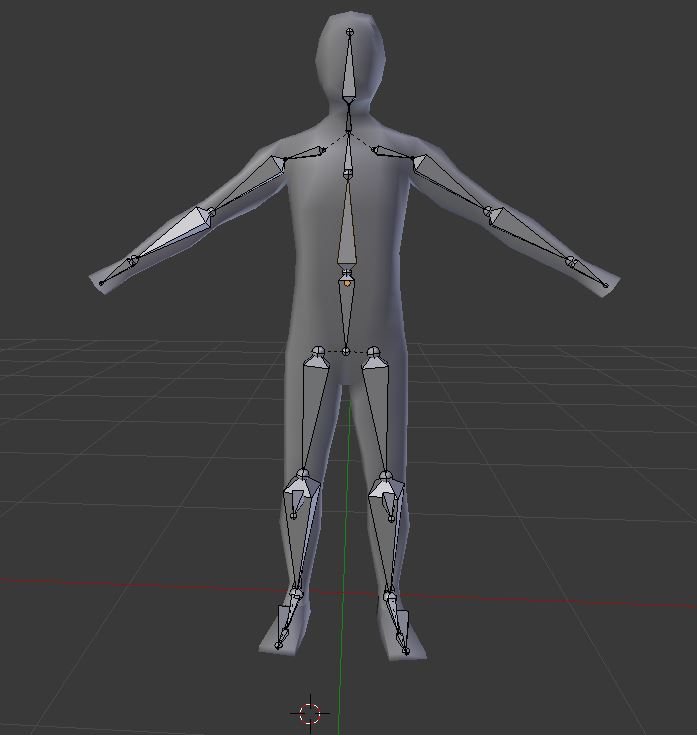
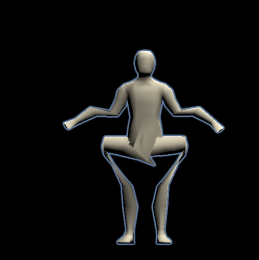
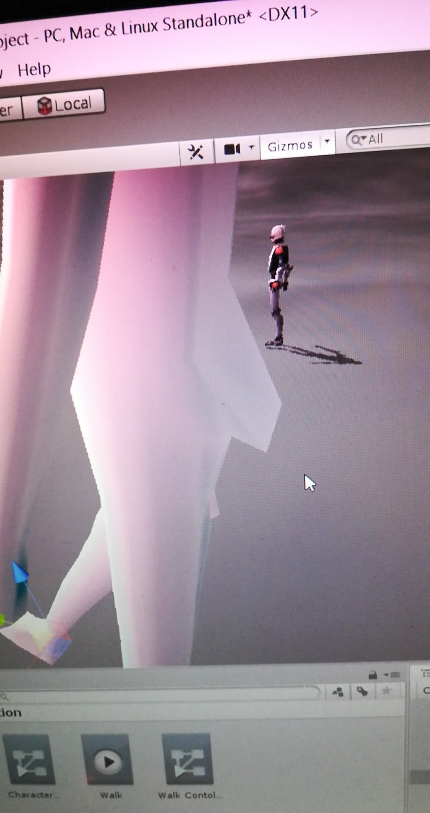
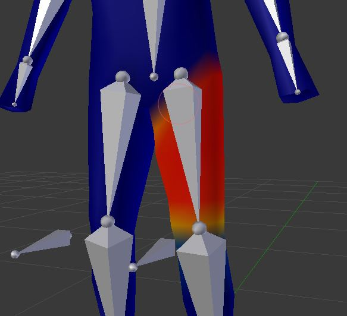

<h1>Week 7: Exporting Blender Files!</h1>

<h3>Recap!</h3>
It's nearly the end of the Independent Study project (two more weeks left!) and the first soft deadline is in two days, the school's Software Engineering Program Expo where all the students from various grade levels show off what they're most proud of. In our group's case (Shi Wei, Xavier, and me), we decided to go with our Independent Study project. What did that mean? A lot of crunching, Shi Wei started pushing for things to be done as best as we could to meet the deadline. For me, I was tasked with creating a fill-in model since he didn't want to use someone else's model as the player character so I went back to creating and rigging a simple model:

 
The big difference this time compared to the model back in week 4 is that this one works! Without any defects when moving the parts too!
<h5>And then came the problems... *sob*</h5>

<h3>No Quick Description This Week!</h3>
Deviating slightly from the past six entries, I'm going to jump straight into what I've done for all of this week in preparation for the expo. Aside from building the model and rigging it, the main task for me was to have the model be ready to be imported into Unity and be functional in Unity. Additionally, since last week's imported mountain model resulted as just a gray heap of nothing after all the texturing, I decided "Ah whatever, I'm just going to make the model and learn texturing for player models AFTER the expo" and that's what I did, a gray bland model which was eventually just dyed bright blue by Shi Wei.
 
The keyword in that last sentence was "eventually" though. A lot of problems arose as I finalized the model on Friday and began shipping out everything over to Shi Wei for testing.

 
Yeah... I didn't know exactly what that abomination was nor did Shi Wei know. We had a good laugh for a minute or two and then it just died down into slight frustration as I tried to quickly resolve the problem. You see, Shi Wei was so adamant about getting me (I'm known to procrastinate just ever so slightly) to finish my assignment as soon as possible for the expo that he made a bet with me. I'd have to pay him and Xavier a $100 each if I was unable to have a model ready to run in Unity by Friday at 10:00 PM. So it was quite honestly a stressful day for me because I was just praying that "oh please just work." We just slowly tried to do what we could, Shi Wei suggesting that I do this and that, delete this bone, re-adjust this bit right here. Eventually he noticed that the model was being squished DOWN and proposed to me that the problem might be a chest armature or somewhere around there. I went around looking at the model and Shi Wei noticed a random constraint bone that I added to the spine to which I explained to him that it was just for me to control the torso in Blender and suggested I delete it. To my surprise, it fixed the model. Then came the second problem.

 
<h3>Weight Painting</h3>
The hip/pelvic region would distort out whenever the legs were moved which Shi Wei and I were definitely not having any of. Immediately I went to work, figuring out that it would probably be the result of the weight of each bone (of the rig) on the model. 

 
What is it that you're looking at in the picture? Don't worry. It's rather simple. If it's dark blue, the rig has zero effect on the model when it's moved. If it's bright red then the rig moves the entire model with it if the rig is moved. Any color in between dark blue and bright red would have a varying effect on the model. That's pretty much Weight Painting in Blender, you just adjust the colors around until everything's as it should be, no distortions or anything. I had to remove most of the color that was present on the single leg bone because it had apparently extended up to the stomach area, causing the distortions whenever the legs were moved.
Overall, a lot of these problems were resolved rather quickly because I communicated with Shi Wei and he did the same with me. Any slight problems that arose concerning the model, he immediately let me know so that I could fix it.
