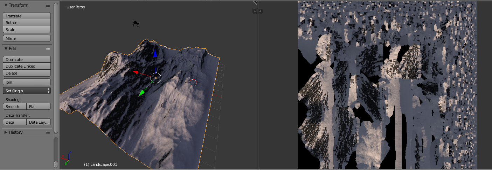
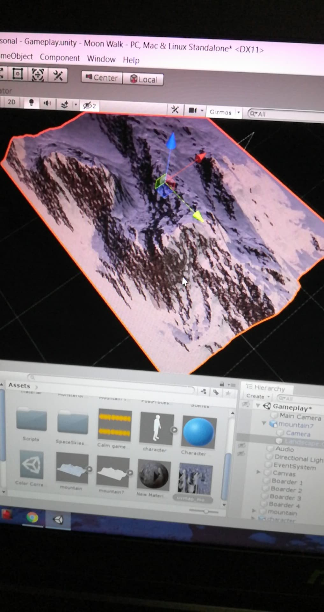
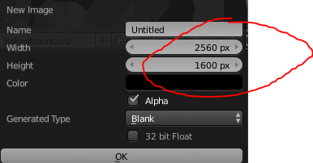
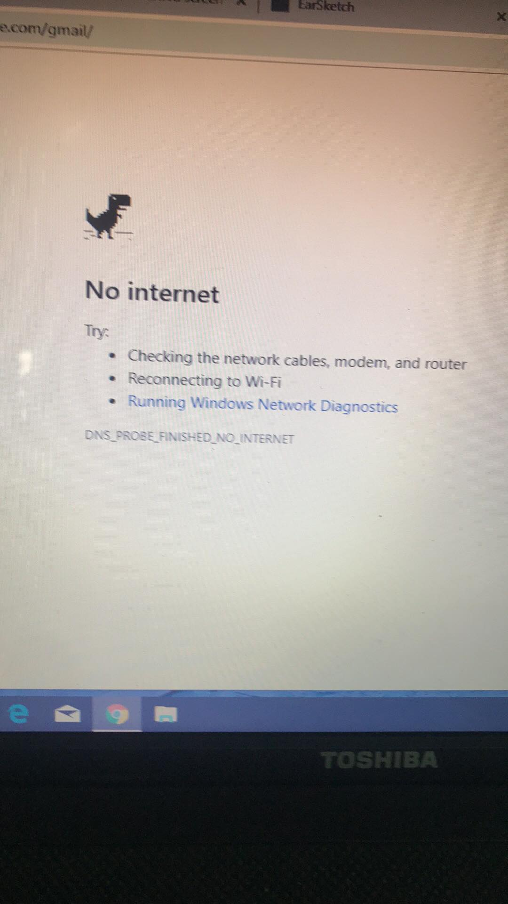
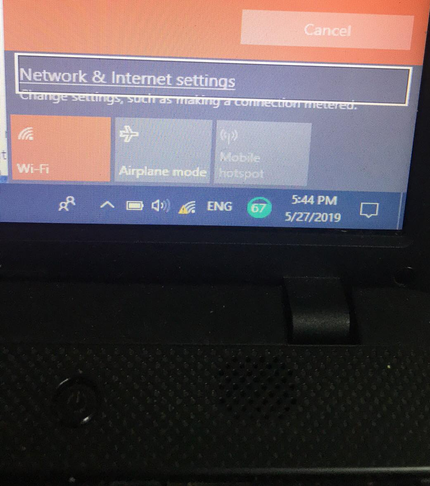

<h1>Week 8: Texture Resolution Problems</h1>

<h3>Recap!</h3>

So, this week was the expo and boy was that exhausting. We had a working demo for the expo and felt like we did pretty well in showing off our product to the judges but alas, we didn't win. After taking two days of relaxing and simply messing around during class, I got back into the groove of working on stuff, in case you haven't read the title somehow, I worked on trying to fix the texture problems for the mountain. My partner had pointed out that the textures had to be baked (yes, baked) and UV map the textures (UV is quite literally unwrapping textures on a model onto a flat plane. UV is the name of the axes of the plane, think of it as the X and Y axes in math). As a result of the several days worth of relaxing, this week's entry is going to be rather short.
  
<h5>The UV map is on the right</h5>

<h3>No Quick Description Again</h3>
Straight into the issues found during this week and the single fix for something since two weeks ago. Good news, Shi Wei and I were able to get the textures of the mountain to appear in Unity. Bad news, it looks really blurry and otherwise not good-looking.
  

So, I spent the remainder of the week trying to fix up the resolution and get it to look cleaner to no avail. A lot of attempts were, well, attempted in order to fix it like:
  
https://blenderartists.org/t/increase-uv-image-quality/497273 
^ This one didn't work because increasing the size of the UV map in photoshop did nothing but increase the size of the image. At one point, the picture became 500 GB in size and I was like 'nope'.

https://blenderartists.org/t/how-to-increase-uv-resolutions/660690 
^ This one also did not work sadly, no clue why though. 
 
So I was pretty much clueless why it wouldn't turn out better. Shi Wei was irked by it but was fine with what we currently have whilst barking some orders at Xavier because he was done too fast.

<h3>Internet, oh why?</h3>
Nearing the end of the week, we decided to fix up bugs and if possible, the textures and work on a better-looking model but you know, the internet is pretty much necessary to do anything since we're quite clueless about the issues we have. It didn't help all too much when all of us had a poor connection the whole weekend.

 
And so, we just said, "whatever, this is what we'll work with for the week".

<h1>Takeaways!</h1>
<ul>
  <li><strong>Problems exist. It's not the end of the world.</strong> Just because you encounter a problem and haven't been able to fix it after several hours worth of work put into it, it's fine. You can eventually fix it. In our case, Shi Wei and I were unable to properly fix the low-resolution textures but again, since it's just the textures, it isn't too important to deal with at the moment.</li>
</ul>
